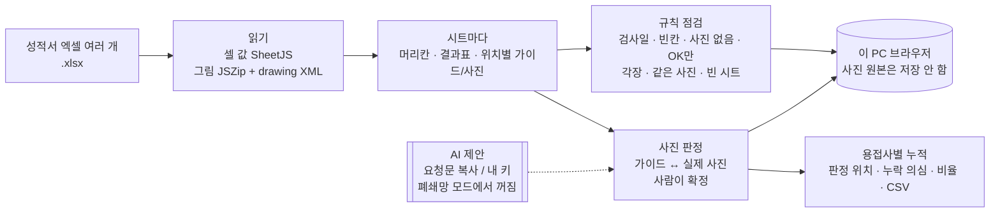

# 용접누락 방지 검출 — 프로젝트 기획서

| 항목 | 내용 |
|---|---|
| 리포 | data09-22 (data09-08 의 과제 C 를 나눈 것) |
| 제출자 | 김무연 |
| 직무·소속 | 인천캠퍼스 부품품질팀 (게시물 3 에 적힌 소속) |
| 과정 | 현장 데이터 디지털화 전문가과정 1차수 |
| 작성일 | 2026-09-29 |
| 문서 상태 | v0.2 (2026-09-30) — 10장 질문 1~5 제출자 답 반영(11장). 라벨 사진 세트는 10월 1일 오전 수령 예정 |

data09-08 기획서(v0.3)의 과제 C 절(8장 「이번 1단계에서는 만들지 않음」, 10장 확인 사항)을 이어받았습니다. 그때 1단계를 미룬 이유는 「실제 성적서 엑셀이 없어 사진 칸·기록 칸 위치를 모른다」였는데, 2026-09-29 메일로 샘플 3건이 와서 **성적서를 읽고 규칙으로 점검하는 부분은 지금 만들 수 있게** 됐습니다. 사진 자체를 AI 로 판독하는 것은 여전히 라벨된 사진 세트가 있어야 검증할 수 있어 2단계로 둡니다.

## 1. 추진 배경과 현안

- 대상: Boom/Arm **내부용접**. 협력사가 위치별(A~F) 용접 사진을 엑셀 「내부용접 검사성적서」에 붙여 회사 포털에 올립니다.
- 용접이 안 된 제품의 사진이 올라왔는데 걸러지지 않았고, 조립 후 고객 사용 중 깨지는 하자가 났습니다.
- 제출자가 정리한 실패 지점: ① 협력사 촬영 시 미검출 ② 사진 등록·본사 검토 시 미검출. 근본 원인은 「불량 정보가 이미 있었는데 확인하고 걸러내는 절차가 없었던 프로세스 단절」.
- 게시물 3 요구: 업로드 시 누락 여부를 검출해 협력사에 알리고, **용접자별 불량률을 누적**.

## 2. 목표

### 2.1 최종 목표 (제출 기획서)

협력사가 성적서를 올리는 시점에 첨부 사진을 판독해 용접누락을 바로 감지하고, 미용접 제품이 입고·조립으로 넘어가지 않게 합니다. AI 판독은 「보완적 안전망」이며, 엑셀에 기록된 이상의 강제 알림·조립 전 확인 체크포인트를 함께 둡니다.

### 2.2 1단계 목표 (이 리포) — 간결하게

**「사람이 보기 전에 규칙으로 걸러 주고, 사람의 판정을 빨리 하게」** 하는 브라우저 도구입니다.

1. 성적서 엑셀을 올리면 시트마다 머리칸·결과표를 읽고, 붙어 있는 사진을 **위치(A~F / 1·2)별로** 꺼냅니다.
2. **규칙 점검(AI 없음)** — 검사일 빈칸·양식 글자, Serial·용접사·검사원 빈칸, 실제 사진 없는 위치, 「정량적 기입」인데 OK 만, 각장 기준 밖, 같은 사진 재사용, 빈 시트, 기록된 불량.
3. **사진 판정** — 위치마다 가이드와 실제 사진을 나란히, 사람이 양호 / 누락 의심 / 판독 불가를 확정합니다. AI 는 제안만(폐쇄망 모드에서는 꺼짐).
4. **용접사별 누적** — 판정한 위치 수·누락 의심 수·비율, 협력사·기종 거르기, CSV.
5. **폐쇄망 모드(기본 꺼짐, 켤 수 있음)** — 2026-09-30 제출자 답 「폐쇄망으로 안 해도 될 듯」에 따라 기본을 껐습니다. 켜면 인터넷 없는 사내 PC 에서도 index.html 만 열어 동작하고 AI 도우미를 숨깁니다.
6. **같은 위치 다른 제품 사진 비교** — 사진 판정 화면에서 같은 기종·부품의 다른 Serial 사진을 같은 위치끼리 나란히(2026-09-30 추가, 11.2 참고).

## 3. 보유 데이터 (2026-09-29 수령 샘플 — 구조만 기록, 원본은 리포에 넣지 않음)

| 파일 | 양식 | 시트 | 확인한 내용 |
|---|---|---|---|
| 4대 묶음 (.xlsx) | 「Boom 내부용접 검사성적서」 | 4장 = Serial 4개 | 제출자 메일 「VDK14W 에 불량 데이터 확인 가능」. 결과 8항목 전부 OK, 검사일은 양식 글자 「월 일」 그대로, 위치 A~F 사진 각 1장 |
| Boom+Arm (.xlsx) | 같은 양식, Boom·Arm 시트 | 2장 | Boom: 각장 칸에 「7」, 연장용접 칸에 「50」 수치 기입, 위치 F 실제 사진 없음. Arm: 머리칸·결과·사진 모두 빈 시트(가이드만) |
| 다른 협력사 (.xls) | 「제관/용접(내부) 공정 검사 보고서」 | 1장 | 옛 엑셀 형식. 위치 번호 1·2, 확인 4항목, 협력사 칸 없음, 위치 1 사진 3장·위치 2 사진 2장 |

**양식 W2(내부용접 검사성적서)의 구조** — 실제 파일에서 확인:

- 머리칸: 2·4행 이름표(협력사 명 · 기종 · 품번 · 품명/옵션정보 / 검사일 · Serial No. · 용접사 · 검사원), 바로 아래 3·5행이 값.
- 「사진촬영 방향」: 7~14행에 붐 그림(A~F 표시), 15~35행에 위치 칸 3줄 × 좌우. 위치마다 **가이드**(B~D·G~H 열, 선 그림 PNG + 빨간 각장 숫자 글상자)와 **실제 사진**(E·I 열, JPEG 한 장).
- 실제 사진 칸에는 「기종명, Serial No., / 각장검사 기록 후 / 사진 촬영」 안내 글이 있어, 이 글의 행·열이 곧 사진 자리입니다.
- 결과표: 37행 머리칸(No. · 검사항목 · 검사기준(W2) · 검사결과(정량적 기입)), 38~45행 8항목 — 용접누락 · 각장 · 언더컷 · 오버랩 · 크레이터 · 기공 · 연장용접 · 일반(서명·사진 누락).
- 각장 기준: 「도면각장(z), 1.0z ≤ z' ≤ 1.25z」. 도면 각장 z 는 가이드 그림 위 빨간 숫자(위치마다 2~4개, 예: 5·5 / 7·6·6·7).
- 한 파일 안에서는 가이드 그림 파일이 시트끼리 같은 것을 가리키고, 실제 사진만 시트마다 다릅니다. 한 파일은 여섯 가이드가 그룹 하나로 묶여 있었습니다(좌표 변환 필요).

**양식 P2(공정 검사 보고서)**: 기종 · 품번 · 작업자 / 날짜 · LOT NO · 검사자, 도면 한 장 위·아래에 번호표(1·2), 번호표 아래 사진 여러 장, 확인 4항목(내부용접 누락 여부 · 언더컷/기공/오버랩/용접누락 · 단품 발청 · ROOT GAP). 가이드 그림·각장 기준 없음.

**라벨된 정상/누락 사진 세트는 아직 없습니다.** 4대 묶음의 24장을 눈으로 봤지만 어느 사진이 불량인지 가려내지 못했습니다(10장 질문 1). → 2026-09-30 답: **Serial 끝 60 의 B·E**(11.2). 라벨 사진 세트는 2026-10-01 오전 수령 예정(11.3).

## 4. 해결 방안 개요

## 5. 주요 기능 — 1단계 / 2단계

| 기능 (제출 기획서 표현) | 1단계(이 리포) | 2단계 이후 |
|---|---|---|
| 위치별 사진 등록 | 협력사가 이미 쓰는 엑셀 성적서를 그대로 올림. 위치별 사진 자동 배정, 위치별 필수 사진 누락 검출 | 협력사 업로드 시점 검출(포털 연동·엑셀 매크로 — 구현 방식 결정 후) |
| 용접누락 판독 | 사람이 판정(양호 / 누락 의심 / 판독 불가). AI 는 제안만(폐쇄망 모드를 켜면 숨김, v0.2 부터 기본 꺼짐). 같은 위치 다른 Serial 사진 나란히 비교(v0.2) | 라벨된 사진으로 AI(사내 에이전트 또는 학습 모델) 파일럿 — 누락 미검출 0건 확인 |
| 판정 처리·재촬영 요청 | 판독 불가 = 재촬영 대상으로 표시, 누락 의심·오류 목록 CSV | 협력사 회신 흐름 |
| 엑셀 기록 기반 강제 알림 | 결과표 「용접누락」 칸이 OK 가 아니면 사진과 관계없이 오류 | 메일 알림(Make 등) |
| 판정 이력·용접자별 불량률 | 판정 기록(덧붙이기만) + 용접사별·협력사·기종 누적, CSV | DB 공유(supabase/schema.sql 준비됨) |
| 성적서 작성 품질 점검 | **(샘플에서 새로 보임)** 검사일 양식 글자 그대로, 빈 시트, 「정량적 기입」에 OK 만, 같은 사진 재사용 | 협력사별 작성 품질 점수 |
| 결과 메일 공유 · 파일럿 성능표 · 품질 판별 | 하지 않음 | 2·3단계 |

## 6. 기대 산출물

- 성적서 점검·사진 판정 웹 도구(정적, 설치 없음, 폐쇄망 동작)
- 규칙 점검 목록과 각 규칙의 근거(9장 표)
- 가상 예시 성적서 3건(`samples/`) — 실제와 같은 배치, 일부러 넣은 문제 포함
- DB 스키마(`supabase/schema.sql`) — 성적서 · 위치별 판정 기록(덧붙이기만) · 용접사별 누적 뷰

## 7. 기술 구성

| 부분 | 선택 | 이유 |
|---|---|---|
| 화면 | 정적 HTML + 일반 script(모듈 아님) | index.html 을 더블클릭(file://)해도 돌아야 폐쇄망 PC 에서 씀 |
| 셀 값 | SheetJS(vendor/) | 날짜·병합 칸 처리 |
| 사진 | JSZip(vendor/) + drawing XML 직접 해석 | SheetJS 무료판은 그림 위치를 주지 않음. 앵커(열·행·오프셋)와 그룹 좌표 변환을 따라가 위치를 정함 |
| 같은 사진 찾기 | 파일 지문(바이트 해시) + 모양 지문(256비트 dHash) | 다시 저장·크기 변경·밝기 조정한 사진도 잡기 위함 |
| 저장 | localStorage | 서버 없음. 사진 원본은 저장하지 않고 지문 + 96px 미리보기만 |
| AI | 반자동(요청문 복사 → 답 붙여넣기) + 선택: 내 OpenAI 키 | 폐쇄망 모드(기본 꺼짐, 켜면)에서는 둘 다 숨김. 키는 브라우저에만 |

## 8. 개발 단계

### 1단계 — 성적서 점검 · 사람 판정 · 누적 (완료, 2026-09-29)

- 위 5장 1단계 열 전부. 가이드와 실제 사진을 나누는 규칙은 실제 파일에서 정했습니다: **그림 왼쪽 끝이 「사진 촬영」 안내 글이 있는 열(E·I)이면 실제 사진, 그 밖이면 가이드.** 가이드는 모두 그룹(선 그림 + 글상자)이고 PNG, 실제 사진은 한 장짜리 JPEG 이라 형식으로도 갈리지만, 협력사가 PNG 로 찍어 붙일 수도 있어 형식이 아니라 자리로 나눴습니다.
- 모양 지문 기준(256비트 중 24 이하 = 비슷함)은 실제 파일로 쟀습니다: 서로 다른 사진 276쌍 중 가장 가까운 것도 40, 같은 사진을 다시 저장·확대·밝기 조정한 것은 4 이하.

### 2단계 — AI 판독 파일럿 (라벨된 사진을 받은 뒤)

- 위치별 정상/누락 라벨 사진(B·E 우선, 경계 사례 포함)으로 AI 판독(사내 에이전트 또는 학습 모델)의 **누락 미검출 · 오탐 · 판독 불가** 비율을 재는 성능표. 1단계 판정 기록이 그대로 정답표가 됩니다.
- 협력사 업로드 시점 연동 방식(포털·엑셀 매크로·별도 페이지)이 정해지면 그 앞단에 1단계 규칙 점검을 붙입니다.
- 여러 사람이 함께 쓸 때 DB(supabase/schema.sql) 연결 — 폐쇄망 요구와 저장 위치를 먼저 정해야 합니다.

### 3단계

- 전 협력사 적용, 결과 메일 공유, 용접 품질(언더컷·기공) 판별, 의심 부위 표시.

## 9. 규칙 점검 목록 (1단계)

| 규칙 | 수준 | 근거 |
|---|---|---|
| 검사일이 비었거나 양식 글자(「월 일」) 그대로 | 오류 | 4대 묶음 4장 전부 해당. 언제 검사했는지 추적 불가 |
| Serial · 용접사 · 검사원 빈칸 | 오류 | 결과표 8번 「일반 — 기종명, Serial No., 서명 누락여부」 |
| 가이드가 있는 위치에 실제 사진 없음 | 오류(위치별) | Boom+Arm 파일의 Boom 위치 F. 제출 기획서 7장 「위치별 필수 등록」 |
| 「검사결과(정량적 기입)」인데 수치 기준 항목이 OK 만 | 확인 필요(한 건으로 묶음) | 양식 머리칸 문구. 각장·언더컷·오버랩·크레이터·기공 |
| 각장 값이 도면 각장 기준(1.0z~1.25z) 밖 | 위치별 값 = 오류, 한 값이 일부 도면 각장에만 맞음 = 확인 필요 | Boom 「7」은 도면 각장 6·7 에는 맞고 5 에는 5~6.25 밖 |
| 같은 사진이 다른 Serial·위치에 다시 쓰임 | 같은 파일 = 오류, 모양 지문 가까움 = 확인 필요 | 제출 기획서 7장 「판정 우회」 대응 |
| 결과표에 용접누락 이상(NG·누락·미완료) 기록 | 오류 | 제출 기획서 5장 병행 조치 「엑셀 기록 기반 강제 알림」 |
| 결과 빈 항목 / 빈 시트 | 오류. 단 같은 파일에 작성된 시트가 있으면 빈 시트는 **참고(쓰지 않은 양식, 건너뜀)** | Arm 시트. 2026-09-30 답: Arm·Boom 은 짝이 아니고 부품에 맞춰 양식을 달리 씀 |
| 양식을 모름 · 결과표 없음 · .xls | 알림(멈추지 않음) | .xls 는 .xlsx 로 저장하는 방법 안내 |

## 10. 확인 필요 사항 (수강생께) — 1~5 는 2026-09-30 답을 받았습니다(11장)

1. **VDK14W 파일에서 불량은 어느 Serial(시트)·어느 위치입니까?** 규칙 점검으로는 4장 모두 「검사일 미기입」「OK 만 기입」만 나오고, 24장 사진을 눈으로 봐서는 누락을 가려내지 못했습니다. 추측으로 정답을 정하지 않았습니다. 알려 주시면 그 사진을 판정 화면의 첫 확인 사례로 씁니다.
2. **협력사가 .xlsx 로 낼 수 있습니까?** 옛 형식(.xls)은 브라우저에서 사진 위치를 읽을 수 없어 한 번 다시 저장해야 합니다(화면에 방법 안내). 처음부터 .xlsx 로 받으면 이 단계가 없어집니다.
3. **Arm 시트는 늘 Boom 시트와 짝입니까?** 받은 파일의 Arm 시트는 비어 있었습니다. 짝이 필수라면 「Arm 시트 빈칸」을 오류로, 아니면 빈 시트를 건너뛰도록 바꾸겠습니다.
4. **용접사별로 사람 이름을 모아 누적해도 되는지** 회사 개인정보 기준 확인이 필요합니다. 어렵다면 이름 대신 사번·협력사 내부 번호로 적도록 양식을 바꾸는 방법이 있습니다. 한 칸에 두 사람이 적힌 경우(띄어쓰기로만 구분)도 있었는데, 쉼표·「/」로 나눠 적어 주시면 각자에게 셉니다.
5. **폐쇄망 요구가 과제 A 와 같습니까?** 협력사 사진을 회사 밖(외부 AI)으로 보내도 되는지에 따라 AI 제안 기능을 쓸 수 있는지가 정해집니다. 지금은 과제 A 와 같이 폐쇄망 모드를 기본으로 켜 두었습니다.
6. **2단계 학습용 라벨 사진 세트** — 위치(A~F)별 정상/누락 사진, 사고가 난 B·E 위치 우선, 판독이 어려운 경계 사례(그을음·어두운 정상 사진) 포함. 이 도구의 판정 기록(CSV)을 그대로 라벨 표로 쓸 수 있습니다.
7. 결과표 「검사결과(정량적 기입)」에 각장을 위치별로 적는 규칙이 있습니까? 한 값(예: 7)만 적으면 도면 각장이 다른 위치(5·6·7)를 모두 판정할 수 없습니다. 「A 5.5, B 7.2」처럼 적으면 위치별로 봅니다.

## 부록. 실제 샘플로 해 본 점검 결과 (이름 가림)

| 시트 | 양식 | 위치별 실제 사진 | 점검 결과 |
|---|---|---|---|
| 4대 묶음 × 4 | W2 Boom | A~F 각 1장 (4장 모두 6/6) | 오류 「검사일 양식 글자」 · 확인 필요 「정량 기입 5항목 OK 만」 |
| Boom | W2 Boom | A~E 1장, **F 0장** | 오류 「위치 F 실제 사진 없음」 · 확인 필요 「OK 만 4항목」 · 확인 필요 「각장 7 이 도면 각장 5 기준 밖」 |
| Arm | W2 Arm | 가이드 A~E, 사진 0 | ~~오류 「빈 성적서」~~ → 참고 「쓰지 않은 양식 시트, 건너뜀」(v0.2) |
| 공정 검사 보고서 | P2 | 1: 3장, 2: 2장 | 참고 「협력사 칸 없음」 |

같은 사진 재사용·비슷한 사진은 실제 파일에서 **0건**이었습니다(모양 지문 최소 거리 40 > 기준 24).

## 11. 2026-09-30 반영 — 제출자 답변

원문: [docs/source/2026-09-30_패들릿_답변.md](source/2026-09-30_패들릿_답변.md) (2026-09-29 16:28 KST 게시물)

### 11.1 확정값

| 10장 질문 | 답 (원문 요지) | 도구에 반영 |
|---|---|---|
| 1. VDK14W 불량 위치 | **Serial 끝 60(SJ25D60), 위치 B·E** | 규칙 점검 결과를 다시 확인(11.2). 라벨 사진 세트의 첫 「누락」 사례로 지정 |
| 2. .xlsx 제출 가능 | 협력사는 **.xlsx 로 작성·제출** | 확인됨. 구현 그대로(.xlsx 읽기). .xls 안내는 예외 상황용으로 남김 |
| 3. Arm·Boom 짝 여부 | **짝이 아님.** 협력사가 만드는 부품에 맞춰 양식을 달리 씀 | 같은 파일에 작성된 시트가 있으면 빈 시트는 오류가 아니라 「참고 — 쓰지 않은 양식 시트, 건너뜀」. 파일 전체가 빈 시트뿐이면 여전히 오류 |
| 4. 용접사 실명 누적 | **실명 누적 가능** | 확인됨. 용접사별 누적 화면의 개인정보 주의 문구를 「제출자 확인됨」으로 바꿈. 사번 전환 제안은 거둠 |
| 5. 폐쇄망 요구 | **폐쇄망으로 안 해도 될 듯** | 폐쇄망 모드 **기본 꺼짐**, 설정에서 켤 수 있게 유지. 예전 판에서 기본값 「켬」이 저장된 브라우저도 사용자가 직접 고른 적이 없으면 새 기본값(꺼짐)을 따름. 꺼져 있어도 성적서·사진은 브라우저 안에서만 읽고, 밖으로 나가는 것은 「AI 제안 받기(내 키)」를 누른 사진뿐 |
| 6. 라벨 사진 세트 | 정상/비정상 사진을 **2026-10-01 오전** 전달 예정 | 받는 형식을 정함(11.3). 도구에 「라벨 사진」 메뉴 추가 — 폴더 이름 점검·위치별 개수·라벨 표 CSV |
| 7. 각장 위치별 기입 | (답 없음) | 남은 확인 |

### 11.2 Serial 끝 60 의 B·E — 도구가 보여 주는 것 (정직한 결과)

실제 파일(VDK14W, 리포 밖에서만 읽음)을 이번 판으로 다시 읽었습니다.

- **규칙 점검은 60 을 다른 세 Serial(57·58·61)과 똑같이 봅니다.** 네 시트 모두 「검사일 양식 글자(오류)」와 「정량 기입 5항목 OK 만(확인 필요)」 두 건뿐이고, 결과표 「용접누락」도 OK 로 적혀 있어 「기록된 누락」 규칙도 걸리지 않습니다. 같은 사진 재사용·비슷한 사진도 아닙니다. 60 의 B·E 에는 사진이 제자리에 한 장씩 있습니다.
- 즉 **이 불량은 성적서의 글자·배치 규칙으로는 잡히지 않는 종류**입니다 — 사진 속 용접 비드가 있느냐의 문제이기 때문입니다. 1단계 규칙이 할 수 있는 것과 없는 것의 경계가 실제 사례로 확인됐고, 이것이 라벨 사진(2단계)이 필요한 이유입니다.
- 사후 관찰(정답을 안 뒤, 비전문가 눈): 같은 위치를 다른 Serial 사진과 나란히 놓으면 차이가 보입니다. 57·58·61 의 B 는 안쪽 판 윗변·아랫변 이음매에 어둡게 이어진 비드 줄이 보이는데 60 의 B 는 윗변이 곧은 선으로만 보입니다. 60 의 E 는 윗변에 짧은 점 두 개(가접으로 보이는 것)만 있고 다른 Serial 처럼 이어진 비드가 없습니다. **한 장만 보면 알아보기 어렵고, 나란히 놓아야 보였습니다.** 제출자 확인이 필요합니다.
- 그래서 사진 판정 화면에 **「같은 위치 다른 제품 사진과 비교」** 를 넣었습니다. 위치 카드마다 같은 기종·부품의 다른 Serial 에서 같은 위치 사진을 모아 보여 줍니다. 규칙이 아니라 사람의 판정을 돕는 기능입니다. 새 규칙(예: 밝기·모양으로 누락 추정)은 라벨 사진으로 검증하기 전에는 만들지 않습니다 — 4장으로 만든 규칙은 거짓 경보나 미검출을 확인할 방법이 없습니다.

### 11.3 라벨 사진 받는 형식 (2026-10-01 오전 수령분)

자세한 안내: [docs/라벨사진_보내는_방법.md](라벨사진_보내는_방법.md). 요지:

- 폴더 `라벨사진_20261001_김무연/` 아래 **라벨 폴더 세 개: 「정상」 · 「누락」 · 「경계」**(사람도 판단이 어려운 사진).
- 파일 이름 **`기종_Serial_위치[_번호][_메모].jpg`** — 예: `VDK14W_SJ25D60_B.jpg`, `VDK14W_SJ25D60_E_1_윗면비드없음.jpg`. 위치는 A~F 또는 1·2.
- 한 파일 = 한 위치. B·E 우선, 같은 기종 다른 Serial 의 정상 B·E 도 함께.
- 받으면 도구의 「라벨 사진」 메뉴로 폴더를 골라 이름을 점검하고 라벨 표 CSV 를 만듭니다. **사진은 공개 리포에 넣지 않습니다.**
- 2단계 첫 산출물: 라벨 표 기준으로 (1) 사람 판정(이 도구의 판정 기록)과 (2) AI 제안이 누락을 몇 장 놓치는지(누락 미검출) · 정상을 몇 장 누락으로 잘못 잡는지(오탐)를 위치별로 센 성능표.

### 11.4 아직 남은 확인

1. 11.2 의 사후 관찰(60 B 윗변 비드 없음, 60 E 윗변 가접 두 점만)이 실제 불량 내용과 맞는지.
2. 10장 질문 7 — 각장을 위치별로 적는 규칙이 있는지.
3. 라벨 사진이 성적서에서 꺼낸 사진(303×227 축소본)인지, 원본 촬영본인지. AI 판독에는 원본 해상도가 유리합니다.

